# CloudBeaver 使用指南

## 一、商品链接

[CloudbBeaver数据库管理云平台](https://marketplace.huaweicloud.com/hidden/contents/c5263ed8-b931-4e9c-8b5f-d7e6b0fb14eb#productid=OFFI1132210185338470400)

## 二、商品说明

‌CloudBeaver 是一个轻量级的web应用程序，专为高效和安全的数据管理而设计。它支持广泛的数据库，包括SQL、NoSQL和云数据库，所有这些都可以通过web浏览器访问。它针对团队协作进行了优化，简化了数据库操作，并允许多个用户在基于云的环境中无缝协作。

本商品通过 鲲鹏服务器 + Huawei Cloud EulerOS 2.0 64bit 进行安装部署。

## 三、商品购买

您可以在云商店搜索 **CloudbBeaver数据库管理云平台**。

其中，地域、规格、推荐配置使用默认，购买方式根据您的需求选择按需/按月/按年，短期使用推荐按需，长期使用推荐按月/按年，确认配置后点击“立即购买”。

### 3.1 ECS控制台自定义购买示例

#### 准备工作

在使用ECS控制台配置前，需要您提前配置好 **安全组规则**。

> **安全组规则的配置如下：**

* 入方向规则放通端口:8978，**源地址内必须包含您的客户端ip**，否则无法访问
* 入方向规则放通 CloudShell 连接实例使用的端口 `22`，以便在控制台登录调试
* 出方向规则一键放通

#### 创建ECS

前提工作准备好后，选择 ECS 控制台配置跳转到[购买ECS](https://support.huaweicloud.com/qs-ecs/ecs_01_0103.html) 页面，ECS 资源的配置如下图所示：

1. 选择CPU架构

2. 选择规格

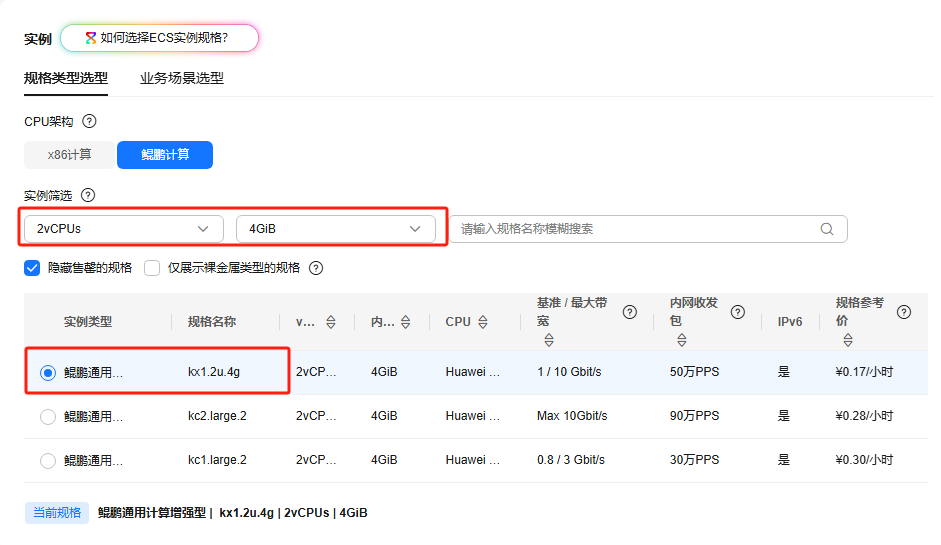
3. 选择镜像

##### 其他参数配置

1. 其他参数根据实际情况进行填写
2. 安全组选择提前配置好的安全组
3. 配置完成之后点击立即购买即可

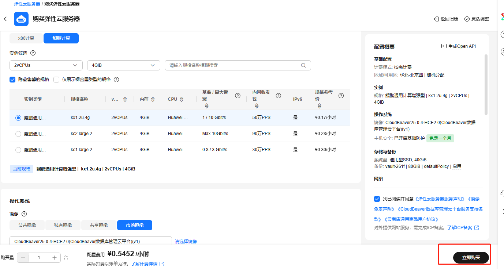

**值得注意的是：**

* VPC 您可以自行创建
* 安全组选择 [**准备工作**](#准备工作)中配置的安全组；
* 弹性公网IP选择现在购买，推荐选择“按流量计费”，带宽大小可设置为5Mbit/s；
* 高级配置需要在高级选项支持注入自定义数据，所以登录凭证不能选择“密码”，选择创建后设置；
* 其余默认或按规则填写即可。

### 3.2 模板部署方式购买示例

#### 购买商品

以购买“spark分布式计算引擎”做为示例，描述模板部署方式购买镜像商品全流程

##### 选择商品

1.在云商店通过商品名称搜索，“spark分布式计算引擎"，进入到商品页

2.选择好地域后，点击“立即购买”

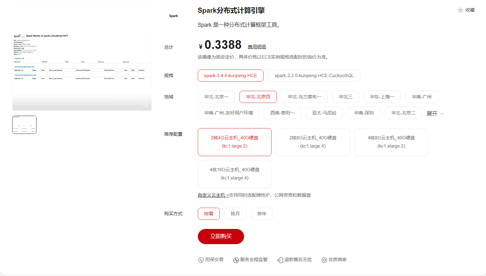

##### 选择开通方式

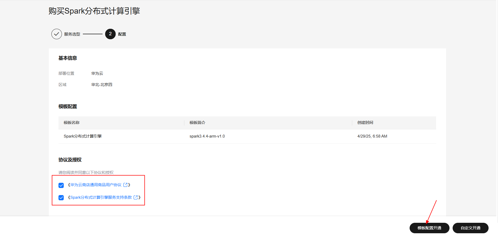

第一步不需要做额外修改，直接下一步
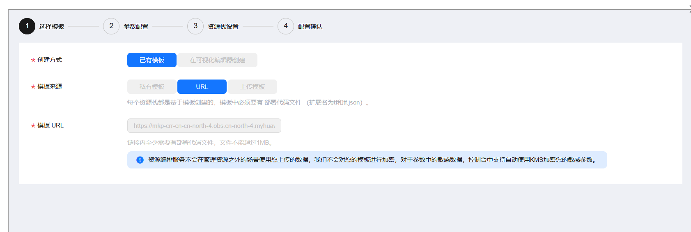

##### 参数配置

第二步进行参数配置，按需填写服务器规格参数后，点击下一步

第三步不需要做额外修改，直接下一步

第四步确认配置后，创建执行计划，点击 确定

创建完成之后点击部署，执行计划

如下图“Apply required resource success. ”即为资源创建完成

## 四、商品使用

### 4.1 CloudBeaver 使用

1. 通过http://{ip}:8978访问UI

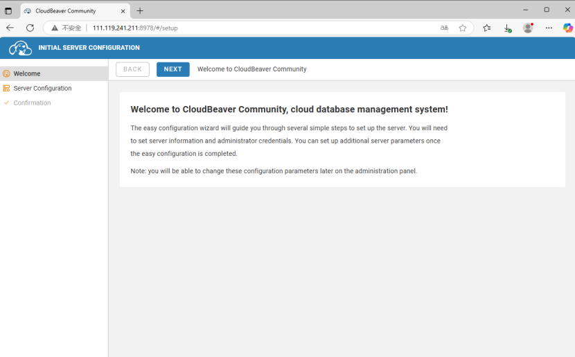
2. 单击Next进入Server Configuration界面，初始化管理员用户密码并关闭匿名访问

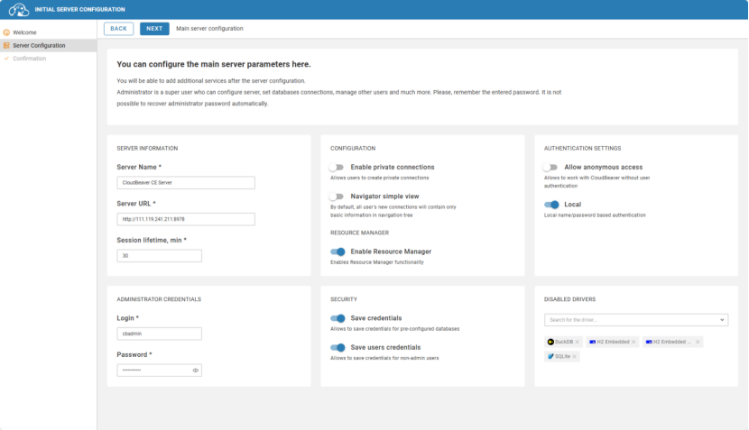
3. 单击Next进入Confirmation界面

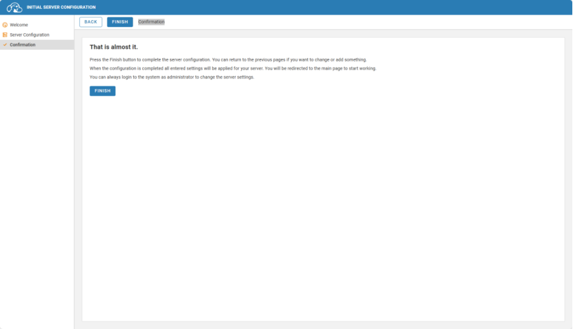
4. 单击Finish后完成服务配置，进入登陆界面

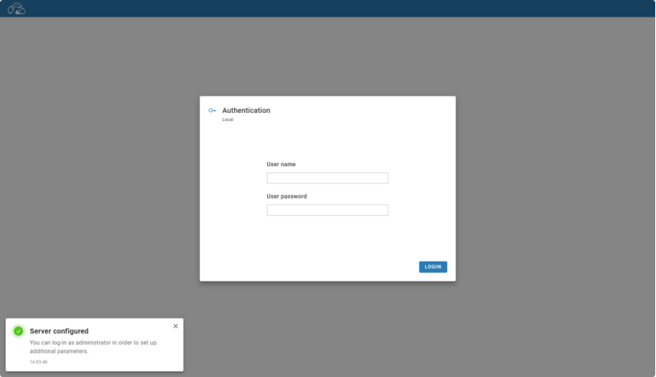
5. 登录成功后，创建数据库连接

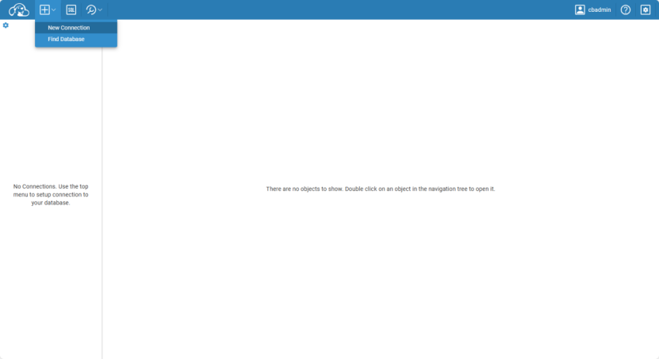
6. 填写PostgreSQL数据库连接信息，单击TEST进行连接测试，通过后单击CREATE创建

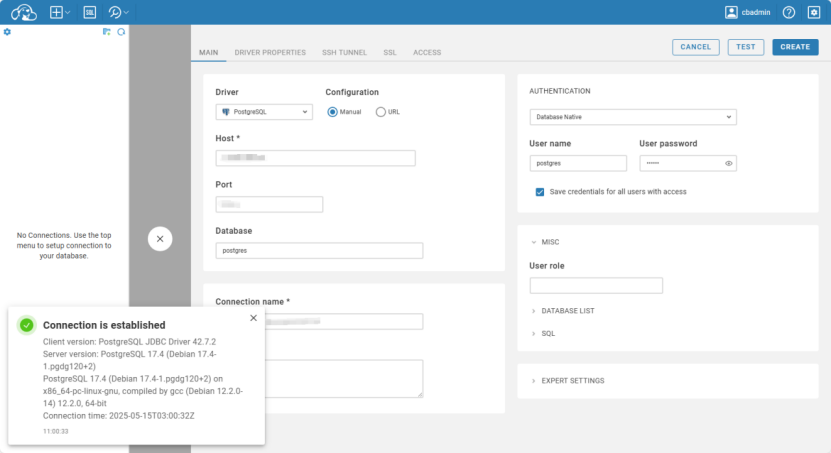
7. 基于新创建的连接打开SQL Editor

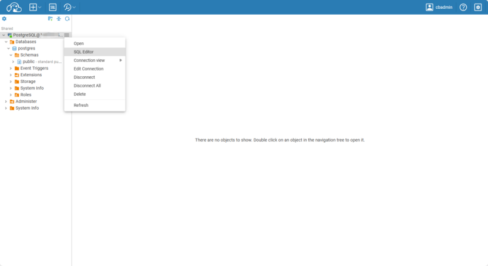
8. 执行SQL查询

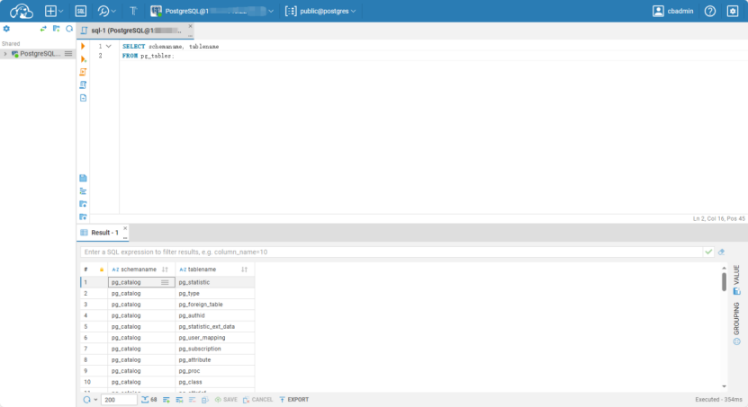

## 参考文档

[CloudBeaver 文档](https://github.com/dbeaver/cloudbeaver/wiki)
